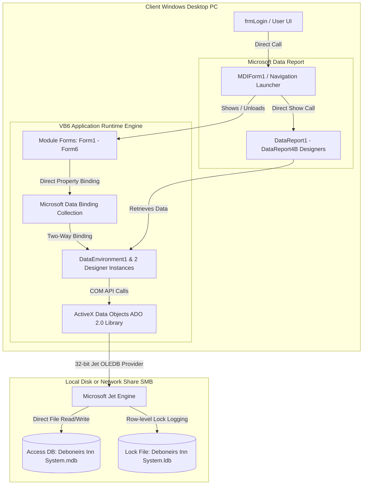
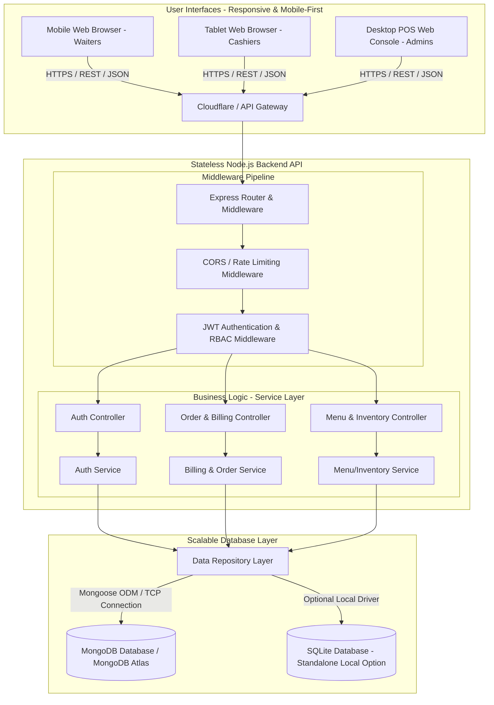

# System Architecture: Modernization Assessment
**Project**: Hot Pizza Management System / Debonairs Inn System Modernization  
**Author**: Antigravity Modernization Agent  
**Date**: June 2026  

---

## 1. Legacy System Architecture (Current State)

The legacy application is a classic Windows desktop client-server monolith. The user interface, business logic, data formatting, and direct database access are coupled within the same desktop executable.

### 1.1. Architecture Description
- **Presentation & Host Layer**: Monolithic Visual Basic 6 (VB6) runtime environment. The UI relies on the Windows Win32 API and native COM-based ActiveX controls. Layouts are strictly coordinates-based (twips), non-responsive, and fail to scale on modern high-DPI displays.
- **Data Access & Binding Layer**: Microsoft ActiveX Data Objects (ADO) 2.0 and Microsoft Data Environment (MSDERUN). It establishes direct connections to the database using the 32-bit OLEDB Provider for Jet. Data is directly bound to form controls, causing tight coupling where UI rendering and database operations occur synchronously on the main UI thread.
- **Database Layer**: Microsoft Access Database Engine (Jet Engine). The database is a single, file-based `.mdb` file (`Deboneirs Inn System.mdb`). Concurrent write actions rely on network file locking via a companion `.ldb` file, which is prone to file corruption and network-share connection locks in multi-user settings.
- **Reporting Layer**: Microsoft Data Report Designer v6.0. Reports are tightly integrated into the project and compiled as part of the monolithic client executable, preventing any updates without full client recompilation.

### 1.2. Legacy Architecture Diagram

---

## 2. Modernized System Architecture (Proposed State)

To address the limitations of the legacy desktop monolith, we propose a modern, secure, and mobile-first **3-Tier Cloud Web Architecture**. Waiters and cashiers will be able to place orders on any device (mobile phones, tablets, or desktop POS stations) over standard HTTPS.

### 2.1. Architecture Description
- **Frontend Layer (Presentation)**:
  - Built as a responsive Single Page Application (SPA) using **React** and **Vite**.
  - Styled with **Tailwind CSS** or Vanilla CSS using mobile-first media queries to support smartphones (for table-side ordering), tablets, and POS terminals.
  - Implements **Progressive Web App (PWA)** capabilities, enabling local caching and offline order queues in case of restaurant network disruptions.
- **Backend API Layer (Application Logic)**:
  - Built as a stateless RESTful API using **Node.js** and **Express.js**.
  - Decoupled from the database using a **Controller-Service-Repository** pattern.
  - Secures endpoints using **JWT (JSON Web Tokens)** and role-based access control (Admin, Cashier, Waiter).
  - Business logic (such as billing sums and tax calculations) is computed securely on the backend rather than in UI event handlers.
- **Database Layer (Data)**:
  - Evaluated Options:
    1. **MongoDB**: Recommended for the target state. A document-based structure allows flexible schemas for menu items, customizations (e.g., pizza toppings, burger add-ons), and order logs containing sub-item arrays.
    2. **SQLite**: Suitable for a standalone, low-footprint local deployment option if the restaurant prefers zero-configuration local hosting.
  - Accessed securely via **Mongoose ODM** (for MongoDB) or **Sequelize ORM** (for SQLite).

### 2.2. Proposed Architecture Diagram

---

## 3. Technology Stack Mapping & Comparison

The following table contrasts the legacy VB6 desktop components with the proposed modernized web architecture:

| Architectural Component | Legacy Component (VB6) | Modern Web Component (Proposed) | Strategic Modernization Rationale |
| :--- | :--- | :--- | :--- |
| **Operating System** | Windows 32-bit (x86 Desktop Only) | Platform Agnostic (Docker, Linux, macOS, iOS, Android) | Allows waiters to take orders on mobile devices and tablet computers, eliminating hardware locking. |
| **Language & Runtime** | VB6 Runtime Engine / COM | React (JavaScript/TypeScript ES6+) / Node.js Runtime | Modern JavaScript/TypeScript provides extensive ecosystem support, long-term security, and cross-platform compatibility. |
| **User Interface (UI)** | twips Absolute Layout Forms | HTML5, React, CSS3 Grid/Flexbox | Fluid layouts automatically scale to any screen size. Eliminates rigid colors and manual coordinates. |
| **Application State** | In-Memory VB6 Forms / Globals | Context API / Redux Toolkit / React Query | Maintains UI state cleanly. Handles API request statuses (loading, error, success) asynchronously. |
| **Database Engine** | MS Access (`.mdb`) / Jet Engine | MongoDB (or SQLite for single-machine setups) | MongoDB handles flexible order schemas (nested options) and scales horizontally. SQLite replaces Access for local file-based needs with zero dependencies. |
| **Data Access Layer** | ADO 2.0 / DataBinding (`MSBIND.dll`) | Mongoose ODM / REST Clients (Axios) | Separates UI rendering from database access. Prevents interface freezing during database queries. |
| **Authentication** | Hardcoded credentials in Form Code | JWT Authentication stored in HttpOnly Cookies | Proper password hashing (bcrypt) and token-based verification. Eliminates plaintext credentials in source code. |
| **Reporting System** | MS DataReport Designer v6.0 | PDF Generation (e.g., pdfkit) / HTML Canvas | Enables cashiers to generate receipts, email invoices directly to customers, or print to wireless network printers. |
| **Deployment** | Manual `.exe` setup & ODBC / DSN configurations | Docker Containers / Vercel Web Deployment | Continuous Integration and Deployment (CI/CD) with instantaneous web updates without client-side installation. |
