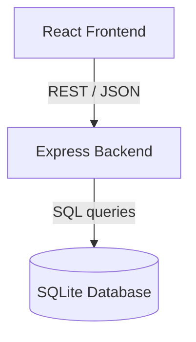

# System Architecture: Modernized Enterprise App

## 1. High-Level Architecture
The application follows a client-server web architecture with decoupled layers:
- **Presentation Layer**: Single Page React Application built with Vite.
- **API Services Layer**: Express.js server exposing RESTful API endpoints.
- **Data Access Layer**: SQLite database using standard SQL transactions.

## 2. Component Design

## 3. Database Schema
- **Customers Table**:
  - `id` INTEGER PRIMARY KEY AUTOINCREMENT
  - `name` TEXT NOT NULL
  - `phone` TEXT
  - `email` TEXT
- **Inventory Table**:
  - `id` INTEGER PRIMARY KEY AUTOINCREMENT
  - `itemName` TEXT NOT NULL
  - `quantity` INTEGER DEFAULT 0
  - `price` REAL DEFAULT 0.0
