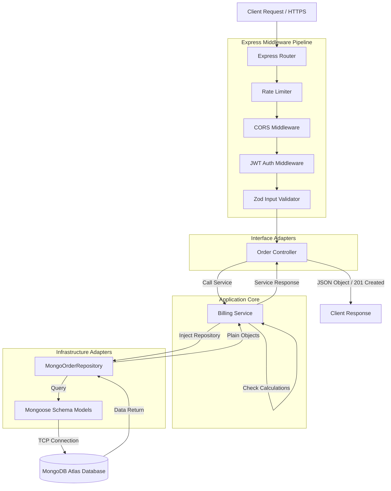

# Modern Backend Architecture: Node.js, Express & TypeScript
**Project**: Hot Pizza Management System / Debonairs Inn System Modernization  
**Author**: Antigravity Modernization Agent  
**Date**: June 2026  

---

## 1. High-Level Backend Overview

The backend is a lightweight, stateless REST API built using **Node.js**, **Express.js**, and **TypeScript**. It is designed to handle high transaction volumes during peak dining hours and supports offline synchronization queues from mobile devices.

To separate database operations from the HTTP routing lifecycle, the backend is organized according to **Clean Architecture** and **SOLID** principles, utilizing **Dependency Injection** to wire the components.

---

## 2. Clean Architecture Layering

The backend codebase is structured into four concentric rings, separating HTTP details from business logic and database configurations.

```
       +---------------------------------------------+
       |             Infrastructure Layer            |
       |  (Express App, Database Configs, Winston)   |
       +---------------------------------------------+
                              |
                              v
       +---------------------------------------------+
       |              Controllers Layer              |
       |  (Request Parsing, Validation Routing)      |
       +---------------------------------------------+
                              |
                              v
       +---------------------------------------------+
       |                Service Layer                |
       |  (Pure Business Logic, Tax/Price Calculations)|
       +---------------------------------------------+
                              ^
                              |
       +---------------------------------------------+
       |              Repositories Layer             |
       |  (Mongoose Models, DB Queries, Data Maps)   |
       +---------------------------------------------+
```

### 2.1. Infrastructure Layer (The Framework)
Contains components that are dependent on external frameworks and tools.
- **Express Server Configuration**: Port bindings, CORS configurations, body parsing.
- **Mongoose Database Connections**: MongoDB connection management and pooling.
- **Winston Logger**: Formats and logs transactions to console and files.

### 2.2. Controllers & Middleware Layer (Interface Adapters)
Transforms incoming network payloads into formats the Service Layer can process, and handles HTTP response serialization.
- **Routers**: Maps HTTP routes to specific controllers.
- **Controllers**: Responsible only for extracting parameters (`req.body`, `req.params`), calling the Service Layer, and sending the appropriate status code.
- **Middlewares**:
  - `authMiddleware.ts`: Inspects and validates JWTs from request authorization headers.
  - `validateMiddleware.ts`: Runs input validations using a schema library (e.g., **Zod** or **Joi**).
  - `errorHandler.ts`: Catches all uncaught service exceptions and formats them as standard JSON error responses.

### 2.3. Service Layer (Core Business Rules)
Contains pure application logic. It operates entirely independently of Express.js.
- **Use Cases & Business Logic**: Handles operations such as cashier authentication, order insertion, and revenue reporting.
- **Calculations**: Ensures that calculations (like multiplying quantity by unit price for chips orders) are calculated on the backend to prevent client-side security bypasses.

### 2.4. Repository Layer (Data Gateways)
Acts as an abstraction barrier between the Database and the Service Layer.
- **Interfaces**: Domain-defined interfaces.
- **Implementations**: Query MongoDB collections using Mongoose models. Decoupling the database driver allows swapping MongoDB with SQLite or PostgreSQL without affecting the service layer code.

---

## 3. SOLID Principles & Dependency Injection

- **Single Responsibility Principle (SRP)**: Each class has a single actor. A controller only converts HTTP to logic parameters; a service only implements the business workflow; a model schema only defines field validations.
- **Open/Closed Principle (OCP)**: Adding a new product module (such as "Beverages" or "Snacks") requires creating a new controller and route definition, without modification to the core auth or base layout routes.
- **Liskov Substitution Principle (LSP)**: The system defines generic repositories (e.g. `IRepository<T>`). We can substitute database implementations for mock test suites without modifying service operations.
- **Interface Segregation Principle (ISP)**: Database queries are segregated into specialized interfaces (e.g. `IOrderReader` vs `IOrderWriter`) to keep service dependencies minimal.
- **Dependency Inversion Principle (DIP) & Dependency Injection (DI)**: Services accept repository interfaces in their constructors, preventing them from instantiating Mongoose models directly. This is wired manually in a container module:

```typescript
// Dependency Injection Wiring Example
const orderRepository = new MongoOrderRepository(MongooseOrderModel);
const billingService = new BillingService(orderRepository);
const orderController = new OrderController(billingService);

// Router binds to the controller method
router.post('/chips', (req, res, next) => orderController.createChipsOrder(req, res, next));
```

---

## 4. Request Pipeline Sequence

The following diagram traces an incoming client request through the backend pipeline to MongoDB:



---

## 5. Security & Session Strategy

1. **JWT Session Token**: Authentic cashiers are issued a stateless JSON Web Token containing their username and role. The token is signed using `HMAC SHA-256` with a rotating environment key (`JWT_SECRET`).
2. **Password Cryptography**: Passwords are never stored in plain text. Cashier accounts use **bcrypt** with a salt round factor of 12.
3. **HTTP Safety**: REST routes implement **Helmet** (HTTP headers security protection), CORS policies limited to authorized clients, and rate limiters to protect endpoints against brute force attacks.
