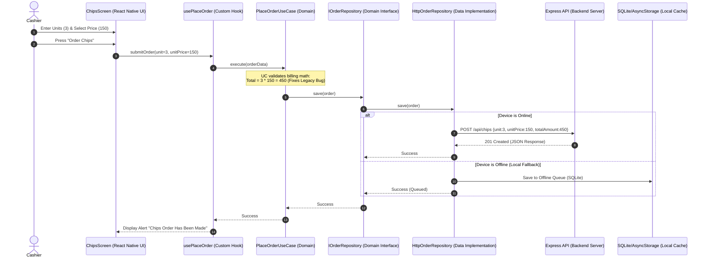

# Modern Mobile Architecture: React Native, Expo & TypeScript
**Project**: Hot Pizza Management System / Debonairs Inn System Modernization  
**Author**: Antigravity Modernization Agent  
**Date**: June 2026  

---

## 1. High-Level Design Overview

The mobile frontend is designed as a cross-platform mobile application using **React Native** and **Expo SDK** in **TypeScript**. It supports table-side ordering for waiters, POS registers for cashiers, and real-time dashboards for restaurant managers. 

To ensure maintainability, scalability, and testability, the mobile codebase follows the **Clean Architecture** pattern and enforces **SOLID** design principles.

---

## 2. Clean Architecture Layering

The application is structured into three decoupled layers: **Domain**, **Data**, and **Presentation**. Dependency flows strictly inward toward the Domain layer.

```
       +---------------------------------------------+
       |             Presentation Layer              |
       |  (UI Screens, Custom Hooks, State/Context)   |
       +---------------------------------------------+
                              |
                              v
       +---------------------------------------------+
       |                Domain Layer                 |
       |   (Core Business Entities & Use Cases)      |
       +---------------------------------------------+
                              ^
                              |
       +---------------------------------------------+
       |                 Data Layer                  |
       |  (Repositories, API Client, Local Caching)  |
       +---------------------------------------------+
```

### 2.1. Domain Layer (The Core)
The Domain layer contains the foundational business logic. It is completely decoupled from any UI frameworks, databases, or network libraries.
- **Entities**: Business models defined using TypeScript interfaces.
  - `Order`: Details unit quantity, item type (e.g., Pizza, Sprite), cashier name, total price, and timestamps.
  - `MenuItem`: Represents foods/drinks details (Sprite, Coke, Burgers, Pizza, IceCream, Chips).
  - `Cashier`: Cashier session profile.
- **Use Cases (Interactors)**: Classes representing single, specific business actions.
  - `LoginCashier`: Validates session credentials.
  - `PlaceOrder`: Manages billing math, triggers data insertion, and verifies correct calculation (e.g., multiplying unit price for chips and validating target Pizza records).
  - `GetSalesSummary`: Calculates cashier sales for reporting.
- **Repository Contracts (Interfaces)**: TypeScript declarations specifying data fetch methods. The Domain layer calls these interfaces without knowing how data is actually retrieved.

### 2.2. Data Layer (Infrastructure)
The Data layer provides data to the domain layer by implementing the repository interfaces. It handles API requests, database clients, and persistent caching.
- **Repository Implementations**: Implement domain interfaces. Executes network requests or falls back to local caches.
- **Data Sources**:
  - **Remote DataSource**: HTTP Client (Axios) pointing to Express API endpoints, and WebSockets (Socket.io-client) for real-time order status logs.
  - **Local DataSource**: Persists tokens using `expo-secure-store`, and caches offline orders using `AsyncStorage` or `Expo SQLite`.

### 2.3. Presentation Layer (User Interface)
The Presentation Layer renders the visual interfaces and responds to cashier actions.
- **Views (Screens & Components)**: React Native screens (styled responsively with Flexbox and NativeWind/Tailwind CSS) containing input fields, receipt previews, and cashier toggles.
- **State Controllers (Hooks & Context)**: React Custom Hooks (e.g. `useOrders`, `useAuth`) that connect screens to use cases. Global UI state is maintained via React Context or Redux Toolkit.
- **Navigation**: Managed via **Expo Router** (file-based navigation system supporting stack and tab layouts).

---

## 3. SOLID Principles Application

1. **Single Responsibility Principle (SRP)**:
   - UI components (e.g., `OrderForm.tsx`) are only responsible for layout and layout interactions.
   - Use cases (e.g., `CalculateTotal.ts`) only handle billing calculations.
   - Custom Hooks (e.g., `useOrderSubmit.ts`) coordinate execution.
2. **Open/Closed Principle (OCP)**:
   - System print actions are defined using a general interface (`IReceiptPrinter`). We can implement Bluetooth printing (`BluetoothPrinter.ts`) or Network printing (`NetworkPrinter.ts`) without modifying the calling checkout code.
3. **Liskov Substitution Principle (LSP)**:
   - The UI depends on the repository contract interface. During testing or offline states, we can swap `HttpOrderRepository` with `MockOrderRepository` or `OfflineOrderRepository` without breaking the application.
4. **Interface Segregation Principle (ISP)**:
   - Client APIs are separated. The `IOrderRepository` is segregated from the `IMenuInventoryRepository`, preventing cashiers from depending on admin stock-management methods.
5. **Dependency Inversion Principle (DIP)**:
   - Presentation hooks do not instantiate repositories directly. Instead, they depend on repository contracts and receive concrete instances via dependency injection or a service registry.

---

## 4. Mobile Architecture Workflow Diagram

The following sequence highlights the flow of control when a cashier places a Chips order:



---

## 5. Mobile-Specific Integrations

- **Offline Queue Sync (PWA/Resiliency)**: Implements a NetInfo listener. When the device loses internet connection, order payloads are written to local SQLite storage. Once connection resumes, a sync service pushes the queue to the backend `/api/sync` endpoint in the background.
- **Hardware Integration**: Uses `expo-print` and Bluetooth LE hooks to compile receipts into HTML formats and print receipts directly to wireless POS thermal receipt printers.
- **Secure Cashier Storage**: Cashier session tokens are stored using `expo-secure-store`, ensuring encrypted storage on both iOS (Keychain) and Android (Keystore).
