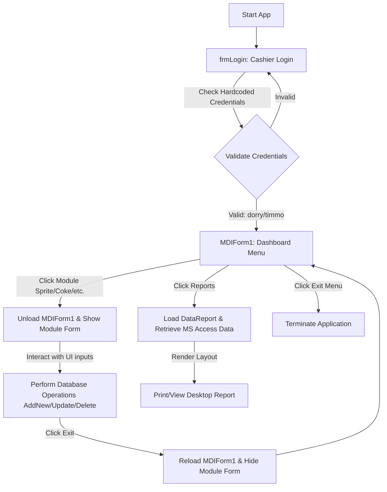

# Legacy System Analysis Report & Feature Inventory
**Project**: Hot Pizza Management System / Debonairs Inn System Modernization  
**Author**: Antigravity Modernization Agent  
**Date**: June 2026  

---

## 1. Executive Summary

This document presents a comprehensive analysis of the legacy **Hot Pizza Management System** (internally referenced as the **Debonairs Inn System**). The application is a 32-bit Windows desktop program built in the late 1990s using **Visual Basic 6.0 (VB6)** and a file-based **Microsoft Access Database (.mdb)**. 

The primary business purpose of this system is to manage order placements, pricing lists, and cashier assignments for a fast-food outlet, specifically supporting six categories: **Sprite** (beverages), **Coke** (coke beverages), **Burgers**, **Pizza**, **Ice Cream**, and **Chips**.

Our technical audit of the codebase has revealed that the application suffers from severe architectural decay, deprecated OLEDB/ADO data access technologies, and **critical billing/persistence bugs** that render key business features non-functional or financially hazardous in its current state.

---

## 2. Legacy Module Deep-Dive & Code Analysis

The system is structured as a collection of 7 user interface forms, 1 MDI launcher window, and 2 database data environments.

### 2.1. Authentication Module (`frmLogin.frm`)
- **Functional Description**: Authenticates cashiers before they can access the order forms.
- **Implementation Analysis**:
  - Contains standard input fields for `Username` (text) and `Password` (masked with `*`).
  - **Critical Flaw**: Credentials are completely hardcoded in plain text in the click event handler (`cmdOK_Click`).
  - Allowed accounts:
    - Username: `dorry` / Password: `dorry`
    - Username: `timmo` / Password: `dorry`
  - **Layout & Style**: Uses the decorative font `"Pristina"` with a purple background (`&H00C000C0&`) and a static picture asset representing the brand.
  - **Workflows**: On success, displays `MDIForm1` and hides itself. On failure, prompts with a message box and shifts focus back to the password textbox.

### 2.2. Main Launcher Module (`MDIForm1.frm`)
- **Functional Description**: Acts as the main application dashboard and routing hub.
- **Implementation Analysis**:
  - Implemented as an MDI container containing menus for `MENU` (Beverages, Snacks, Food), `REPORTS` (Ice cream Report, Sprite Report, Burger Report), and `EXIT`.
  - **Critical Structural Issue**: MDI containers are designed to host MDI children. However, the system's modules (`Form1` to `Form6`) are standard forms. When a menu item is clicked, the application shows the target form and unloads the MDI container:
    ```vb
    Private Sub Sprite_Click()
        Form1.Show
        Unload Me
    End Sub
    ```
    This destroys the main menu context, forcing the sub-forms to manually re-instantiate `MDIForm1` upon exit (`MDIForm1.Show`). This makes navigation highly fragile and resource-heavy.

### 2.3. Sprite Module (`Form1.frm`)
- **Functional Description**: Manages Sprite drink sales.
- **Data Source**: Bound to `DataEnvironment1.rsSprite` (Sprite table).
- **Core Logic & Bugs**:
  - Includes a dropdown list for quantities (`Combo1` containing values from `100ml` to `1000ml`).
  - **Compile/Run-time Bug**: The `Combo1_Click` event contains pricing rules mapping volumes to prices:
    ```vb
    Private Sub Combo1_Click()
        If Trim(Combo1.List(Combo1.ListIndex)) = "100ml" Then
            txtPriceTag.Text = 250
        '...
    End Sub
    ```
    However, there is **no control named `txtPriceTag`** on `Form1`. The form contains a ComboBox named `spritePrices` instead. Referencing a non-existent control causes a crash.
  - **Validation Bug**: `cmdOrder_Click` checks for `"Sprit Duo"` (with a typo, missing 'e').

### 2.4. Coke (Ice Cream) Module (`Form2.frm`)
- **Functional Description**: Manages Coke beverage orders (incorrectly captioned as "Ice cream" in some menus due to a copy-paste mismatch).
- **Data Source**: Bound to `DataEnvironment1.rsCoke` (mapped to `cmdCoke` Command).
- **Core Logic**:
  - Inputs for Drink Type, Type (Regular/Diet), Quantity, and Price.
  - Controls are directly data-bound. The Order button executes a blank record creation: `DataEnvironment1.rsCoke.AddNew`.

### 2.5. Burger Module (`Form3.frm`)
- **Functional Description**: Manages burger order entries.
- **Data Source**: Bound to `DataEnvironment1.rsBurger` (mapping to the table `Burger`).
- **Core Logic & Mismatch**:
  - Controls are bound to fields: `TypeofBurger`, `WeightOfBurger`, `ServedWith`, and `Cashier`.
  - **Inconsistency**: In the DataEnvironment, the recordset command is named `cmdBuga`, but in code, it is referenced as `rsBurger`, which is standard VB6 generator behavior for matching table name alias, but creates developer confusion.

### 2.6. Pizza Module (`Form4.frm`)
- **Functional Description**: Manages pizza order placement.
- **Data Source**: Bound to `DataEnvironment1.rsPizza`.
- **Core Logic & Critical Bugs**:
  - **Syntax/Compilation Error**: The `cmdAddNew_Click` event contains:
    ```vb
    Private Sub cmdAddNew_Click()
        .rsPizza.AddNew
    End Sub
    ```
    In VB6, a dot prefix is only valid within a `With` block. Lacking a `With` context, this statement fails compile-time check.
  - **Critical Data Integrity Bug**: The order button `cmdOrder_Click` calls the wrong recordset:
    ```vb
    Private Sub cmdOrder_Click()
        DataEnvironment1.rsBurger.AddNew
        MsgBox "The Order has Been Made"
    End Sub
    ```
    **Effect**: Placing a Pizza order actually inserts a blank record into the Burger database table, failing to record any Pizza orders in the system.

### 2.7. Chips Module (`Form6.frm`)
- **Functional Description**: Manages take-away chips orders.
- **Data Source**: Bound to `DataEnvironment1.rsChips`.
- **Core Logic & Critical Billing Bug**:
  - The form includes a `SUM` button (`Command1`) to compute the total order amount based on the ordered Units (`txtUnit`) and the Unit Price (`Combo3`).
  - **Critical Billing Error**: 
    ```vb
    Private Sub Command1_Click()
        If txtUnit.Text <> "" And Combo3.Text <> "" Then
            txtTotalAmount.Text = Val(txtUnit.Text) + Val(Combo3.Text)
        End If
    End Sub
    ```
    **Effect**: The calculation **adds** the quantity and unit price instead of multiplying them. For example, buying 2 packs of chips at 150 each computes a total of `152` instead of `300`. This leads to catastrophic pricing loss.
  - **Disabled Feature**: `cmdAddNew_Click` has the data insertion code commented out: `'DataEnvironment1.rsChips.AddNew`.

---

## 3. Feature Inventory

The following matrix documents every user interface screen, its input structures, target database destinations, business actions, and current status:

| Module / Page | Input Fields & Types | Database Table | Actions Provided | Status & Critical Bugs Identified |
| :--- | :--- | :--- | :--- | :--- |
| **Login Screen** (`frmLogin.frm`) | - Username (Text)<br>- Password (Password) | *None* (Static) | - Authentication (`Login`) | **Defective**: Plaintext hardcoded credentials inside the code behind. No DB connection. |
| **Sprite Beverage** (`Form1.frm`) | - Drink Name (Combo)<br>- Type (Combo)<br>- Quantity (Combo)<br>- Price (Combo) | `Sprite` | - Add New Order<br>- Order (Validate "Sprit Duo")<br>- Update Menu | **Broken**: Referencing non-existent `txtPriceTag` causes a runtime crash during quantity selection. Typo `"Sprit"` in code. |
| **Coke Beverage** (`Form2.frm`) | - Drink Name (Combo)<br>- Type (Combo)<br>- Quantity (Combo)<br>- Price (Combo) | `Coke` | - Add New Order<br>- Delete Record<br>- Update Drink | **Active**: Simple data-binding works, but there is no validation or price lookup logic. |
| **Burger Sales** (`Form3.frm`) | - Burger Type (Combo)<br>- Weight (Combo)<br>- Served With (Combo)<br>- Cashier (Combo) | `Burger` | - Add Burger<br>- Clear History<br>- Update MyList | **Active**: Form connects and saves, but lacks dynamic pricing. Confusing discrepancy between DB command (`cmdBuga`) and recordset. |
| **Pizza Sales** (`Form4.frm`) | - Pizza Desc (Combo)<br>- Unit (Text)<br>- Unit Price (Combo)<br>- Total Amount (Text)<br>- Cashier Name (Combo) | `Pizza` | - Add New Pizza<br>- Order Pizza<br>- Clear Menu<br>- Update Menu | **Broken**: <br>1. Syntax error `.rsPizza.AddNew` causes compilation failure.<br>2. `cmdOrder_Click` writes data to the `Burger` table instead of `Pizza`. |
| **Ice Cream** (`Form5.frm`) | - Description (Combo)<br>- Colour (Combo)<br>- Flavour (Combo)<br>- Price (Combo)<br>- Cashier (Combo) | `IceCream` | - AddNew Order<br>- Order IceCream<br>- Clear Menu<br>- Update Menu | **Active**: Functional but lacks dynamic UI validation. Uses a separate disconnected ComboBox for price input. |
| **Chips Sales** (`Form6.frm`) | - Unit / Qty (Text)<br>- Unit Price (Combo)<br>- Total Amount (Text)<br>- Cashier (Combo) | `Chips` | - AddNew Order (Disabled)<br>- Order Chips<br>- SUM Total Price<br>- Update Menu | **Broken**: <br>1. SUM button adds units to price (`Total = Units + Price`) instead of multiplying.<br>2. AddNew Order action is commented out in code. |
| **Reporting Hub** (`MDIForm1` / `Reports`) | *None* | `Sprite`, `Coke`, `Burger` | - Print Sprite Report<br>- Print Ice Cream Report<br>- Print Burger Report | **Broken/Incomplete**: Links to MS DataReports (which require 32-bit ODBC configurations). `DataReport4.Dsr` class duplicate. |

---

## 4. Legacy Database Schema (Data Dictionary)

The database `Deboneirs Inn System.mdb` is structured around 6 tables. The fields and datatypes mapped from `DataEnvironment1` are:

### 4.1. Table: `Sprite`
*Stores beverage inventory and transaction logs.*
- **DrinkName** (Memo / Long Text): Name of the drink (e.g., Sprite).
- **PriceTag** (Currency / Decimal): Price of the transaction.
- **Quantity** (Text / VarChar): Quantity purchased (e.g., "300ml").
- **Type** (Text / VarChar): Drink temperature or type (e.g., Cold, Hot).

### 4.2. Table: `Coke`
*Stores Coke transaction logs.*
- **DrinkName** (Text / VarChar): Beverage identifier.
- **PriceTag** (Currency / Decimal): Retail price.
- **Quantity** (Text / VarChar): Size in ML.
- **Type** (Text / VarChar): Flavor / Diet type.

### 4.3. Table: `Burger`
*Stores burger orders.*
- **TypeofBurger** (Memo / Long Text): Type of burger selected (e.g., Beef, Chicken).
- **PriceTag** (Currency / Decimal): Cost of burger order.
- **WeightOfBurger** (Text / VarChar): Weight identifier (e.g., "150g").
- **ServedWith** (Memo / Long Text): Accompaniment list (e.g., Chips, Salad).
- **Cashier** (Memo / Long Text): Cashier name logging the order.

### 4.4. Table: `Pizza`
*Stores pizza orders.*
- **PizzaDescription** (Memo / Long Text): Pizza variety (e.g., Margherita, Pepperoni).
- **Unit** (Long Integer): Count of pizzas ordered.
- **UnitPrice** (Text / VarChar): Price per unit (stored incorrectly as Text).
- **TotalAmount** (Currency / Decimal): Calculated total transaction cost.
- **CashierName** (Memo / Long Text): Cashier identifier.

### 4.5. Table: `IceCream`
*Stores dessert transactions.*
- **Description** (Memo / Long Text): Product description.
- **Colour** (Text / VarChar): Ice cream visual color.
- **Flavour** (Text / VarChar): Flavour descriptor (e.g., Chocolate, Vanilla).
- **Price** (Currency / Decimal): Price of the dessert.
- **Cashier** (Memo / Long Text): Cashier logging the order.

### 4.6. Table: `Chips`
*Stores chips transactions.*
- **Unit** (Long Integer): Count of chips packages.
- **UnitPrice** (Text / VarChar): Price per unit (stored incorrectly as Text).
- **TotalAmount** (Currency / Decimal): Total billing amount.
- **ServedWith** (Memo / Long Text): Side additions (e.g., Tomato Sauce, Salt).
- **Cashier** (Memo / Long Text): Logging cashier.

---

## 5. System Workflows



### 5.1. Data Persistence Workflow
1. **Binding Initialization**: At form load, ADO bindings connect visual controls (ComboBoxes, TextBoxes) directly to recordset fields using `DataEnvironment1`.
2. **Buffering**: Data entered into a control is buffered within the ADO recordset's local buffer.
3. **Execution**:
   - `AddNew`: Clears controls and creates a new row insertion buffer.
   - `Update`: Flushes the ADO buffer, writing the SQL `INSERT` or `UPDATE` statements to the Access Jet Engine, persisting changes to `Deboneirs Inn System.mdb`.
   - `Delete`: Deletes the current record in the active row buffer.
4. **Issue**: Since the UI controls are bound directly, any crash during form interaction (like `Form1` PriceTag crash) rolls back the buffer or locks the Access database file (`.ldb` lock file issues).

---

## 6. Modernization Drivers

1. **Security Vulnerabilities**: Hardcoded credentials and plaintext `.mdb` access are severe security risks.
2. **Platform Obsolescence**: Visual Basic 6.0 runs strictly on legacy 32-bit frameworks, blocking execution on modern servers, tablets, and mobile devices.
3. **Data Integrity Failures**: Multiple copy-paste logic bugs in the original code produce corrupt orders (Pizza orders saved as Burgers) or financial calculation losses (Chips addition bug).
4. **Desktop Confinement**: The system lacks remote access, making it impossible to check sales, input orders on tables, or view reports outside the physical Windows PC at the counter.
5. **No Concurrency**: MS Access database locks under multi-user access, causing database corruption if multiple cashiers access the app concurrently.
